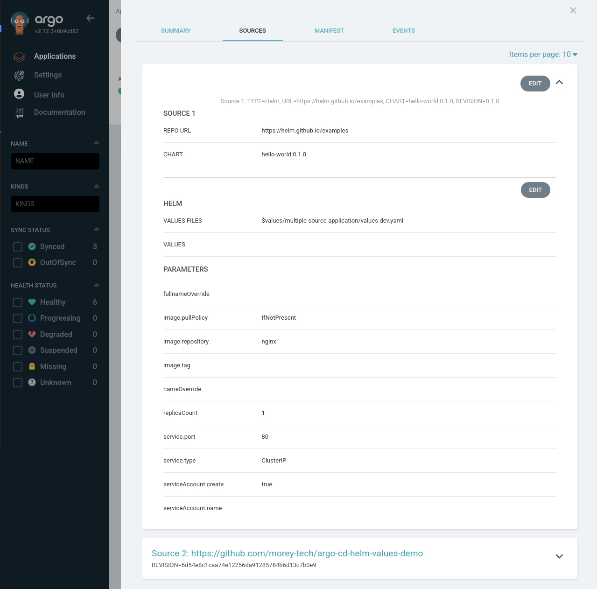

# What's New in Argo CD v2.12?

## 2. Sources Tab in Application Details

> Implemented by [Keith Chong](https://github.com/keithchong) in [#17275](https://github.com/argoproj/argo-cd/pull/17275), closing [#17274](https://github.com/argoproj/argo-cd/issues/17274)

In the original implementation of multiple sources for `Application`s, the UI only displayed the first source of an Application, and the parameters couldn't be edited.

As of Argo CD v2.12, support has been added to show all the sources of the multi-source application under a new `Sources` tab (which replaces the `Parameters` tab). However, the parameters are still read-only.

Instead of the source information located in the `SUMMARY` tab of the `Application` details, it and parameters have been combined into the new `SOURCES` tab.

