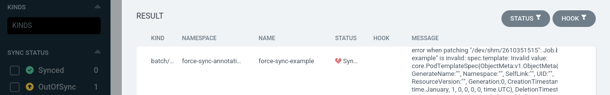

# What's New in Argo CD v2.12?

## 5. Force Sync Application Annotation

> Implemented by [Kota Kimura](https://github.com/kkk777-7) in [#560](https://github.com/argoproj/gitops-engine/pull/560) of the [gitops-engine](https://github.com/argoproj/gitops-engine) and [#17866](https://github.com/argoproj/argo-cd/pull/17866) of argo-cd, closing [#414](https://github.com/argoproj/gitops-engine/issues/414) and [#5882](https://github.com/argoproj/argo-cd/issues/5882).

To update some common Kubernetes resources such as a `Job`, `CronJob`, or directly managed `Pods`, the `--force` option is required (e.g. `kubectl replace --force`). Argo CD has the ability to use `--force` for an entire sync operation, however this can be a destructive actions causing unintended downtime for services.

Without the ability to force replace a single resource, an Application with a Job using a static name will fail to apply because the resource already exists.



Argo CD 2.12 introduces support for the `Force=true` in the `argocd.argoproj.io/sync-options` annotation. This addition is an excellent complement to the existing `Replace=true` option to fully replicate the `kubectl replace --force` option on a **per resource basis**.

```yaml
metadata:
  annotations:
    argocd.argoproj.io/sync-options: Force=true,Replace=true
```

The combination of the `Replace=true` and `Force=true` options also serves as a way to ensure that a job is run each time an Application is synced or to address any resource that is immutable (i.e. doesn't work with `kubectl apply`, e.g. an `iam.cnrm.cloud.google.com/IAMPolicyMember`).
